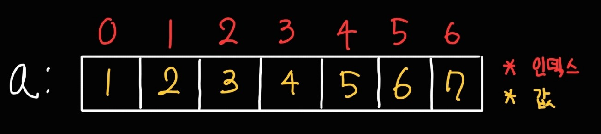

---
title: '기초 자료구조(1) - 배열'
published: 2025-04-03
description: '배열에 대해'
tags: ['PS', '알고리즘', 'Python']
category: '알고리즘'
draft: false 
lang: 'ko'
--- 

기초부터 시작하자.
파이썬 기준으로 작성

## Array(배열)이란
### 배열의 정의
배열(Array)은 동일한 데이터 타입의 변수들이 메모리에 연속해서 할당된 자료구조이다.


a라는 배열이 위와 같이 있다고 하자.<br/>
a배열의 첫번째 값(`1`)을 불러오고 싶다면

```py
a = [1,2,3,4,5,6,7]
print(a[0])

# 1
```
와 같이 **인덱스**의 번호를 대괄호와 함께 입력한다.<br/>
대부분의 프로그래밍 언어는 **배열 인덱스의 번호는 0부터 시작한다는 것을 유의**하자.

## 배열 사용처
배열은 언제 언제 사용해야 하는가?
### 1. 수열을 저장할 때
ex) 피보나치 수열 100개의 항
```py
a = [1, 1, 2, 3, 5, 8]

a[0] #=> 1
a[2] #=> 2
```

### 2. 무언가를 체크할 때.
ex) 학급에서 출석체크
```py
a = [0] * 10 # 0값을 가진 10 크기의 배열을 생성

a[0] = 1 # 1번 학생 출석
a[2] = 1 # 2번 학생 출석
a[4] = 1 # 5번 학생 출석
a[5] = 1 # 6번 학생 출석
...
```

### 3. 무언가를 카운트 할 때
ex) 투표 시스템
```py
a = [0] * 4 # 4명의 후보 (기본값: 0표)

a[0] = a[0] + 1 # 1번 후보에게 한 표
a[2] = a[2] + 1 # 3번 후보에게 한 표
a[0] = a[0] + 1 # 1번 후보에게 한 표
a[1] = a[1] + 1 # 2번 후보에게 한 표

print(a) # => [2,1,1,0] => 1번 후보 당선
```