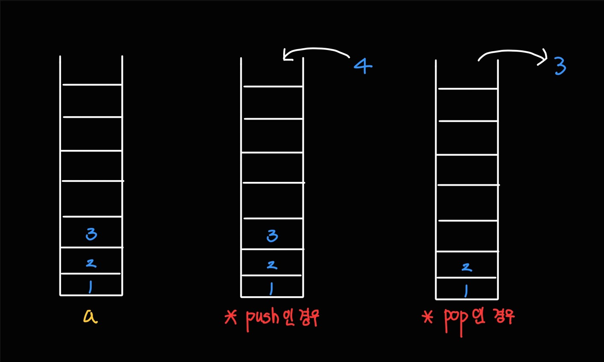

스택에 대해서 알아보자

## 스택(Stack) 자료구조
스택은 배열과 비슷해 보이지만 데이터를 **추가**하고 **제거**하는 방식이 다르다.<br/>
스택은 기본적으로 `LIFO(Last In Frist Out)`을 따른다. 쉽게 말하면 후입선출이다.


쉽게 생각해보자. 스택은 그냥 입구가 하나뿐인 엘레베이터라고 생각하면 된다.<br/>
**먼저 탄 사람**이 내릴때에는 **가장 마지막에 내리는 것** 처럼 말이다.

Python에서는 push를 `append`, pop을 `pop`함수를 통해 지원하고 있다.

간단한 스택 자료 구조를 작성해보자.

```py
a = []

a.append(1) # a : [1]
a.append(4) # a : [1, 4]
a.append(5) # a : [1, 4, 5]

x = a.pop() # x: 5, a : [1, 4]
x = a.pop() # x: 4, a : [1]
x = a.pop() # x: 1, a : []
```

1. `append` 함수는 스택 제일 오른쪽에 데이터를 추가하는 함수이다.
2. `pop`은 스택 `a[-1]`의 데이터를 가져오고 그 값은 스택에서 삭제한다.

이제 이론을 배웠으니 백준 문제를 통해 실천해보자.

## 스택 사용 예제1 - BOJ 10773번. 제로
[바로가기](https://www.acmicpc.net/problem/10773)

### 문제
나코더 기장 재민이는 동아리 회식을 준비하기 위해서 장부를 관리하는 중이다.

재현이는 재민이를 도와서 돈을 관리하는 중인데, 애석하게도 항상 정신없는 재현이는 돈을 실수로 잘못 부르는 사고를 치기 일쑤였다.

재현이는 잘못된 수를 부를 때마다 0을 외쳐서, 가장 최근에 재민이가 쓴 수를 지우게 시킨다.

재민이는 이렇게 모든 수를 받아 적은 후 그 수의 합을 알고 싶어 한다. 재민이를 도와주자!

### 입력
첫 번째 줄에 정수 K가 주어진다. (1 ≤ K ≤ 100,000)

이후 K개의 줄에 정수가 1개씩 주어진다. 정수는 0에서 1,000,000 사이의 값을 가지며, 정수가 "0" 일 경우에는 가장 최근에 쓴 수를 지우고, 아닐 경우 해당 수를 쓴다.

정수가 "0"일 경우에 지울 수 있는 수가 있음을 보장할 수 있다.

### 출력
재민이가 최종적으로 적어 낸 수의 합을 출력한다. 최종적으로 적어낸 수의 합은 231-1보다 작거나 같은 정수이다.

<hr style="border:0; height:2px; background-color: white"/>

제대로 스택에 대해 이해하고 있다면 문제를 읽자마자 코드가 떠오를 것이다.<br/>
아래에는 해설이 있으니 아직 해결하지 못했다면 충분히 고민한 후 보는 것을 추천한다.


### 해설
<details><summary>코드 보기</summary>

문제를 읽자마자<br/>`"아! input값으로 0이 들어오면 pop을, 아니라면 그 값을 stack에 저장하면 되겠구나!"`<br/>라는 생각이 들었는가?

아니라면 아직 Stack의 개념을 잘 모르는 상태로 공부하고 있는 것이다. 

```py
import sys
input = sys.stdin.readline

K = int(input())
stack = []

for i in range(K):
    N = int(input())
    if N == 0:
        stack.pop()
    else:
        stack.append(N)

print(sum(stack))
```
</details>

