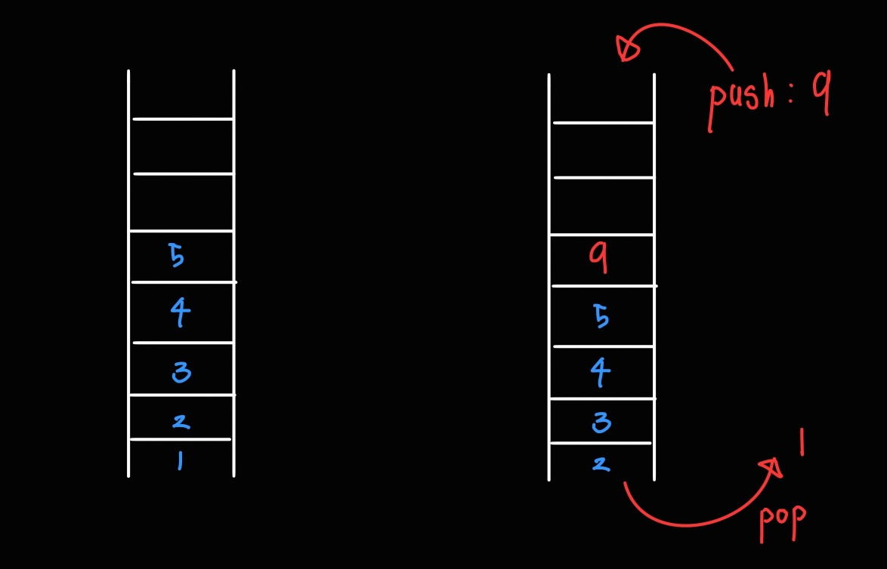

큐에 대해서 알아보자

## 큐(Queue) 자료구조
큐도 배열, 스택과 비슷해 보이지만 데이터를 **추가**하고 **제거**하는 방식이 다르다.<br/>
큐은 `FIFO(First In Frist Out)`을 따른다. 쉽게 말하면 선입선출이다.


한번쯤은 아래 사진처럼 육교 엘레베이터를 본 적이 있는가?

큐는 스택과 다르게 **입구가 양쪽에 있는 엘레베이터**라고 생각하면 된다.<br/>
**먼저 탄 사람**이 내릴때에는 **가장 먼저 내리는 것** 처럼 말이다.

Python에서는 `collections` 라이브러리의 `deque`를 사용하여 큐를 간단하게 구현이 가능하다.<br/>
하지만 `deque`는 정확하게 말하면 덱이라는 자료 구조인 것을 명심하자.

* 덱(Deque) : 스택과 큐를 혼합한 자료구조 → 양쪽에서 삽입과 삭제가 가능한 구조 


간단한 큐 자료 구조를 작성해보자.

```py
from collections import deque

a = deque()

a.append(1) # a : [1]
a.append(4) # a : [1, 4]
a.append(6) # a : [1, 4, 6]

x = a.popleft() # x: 1 a: [4, 6]
x = a.popleft() # x: 4 a: [6]
x = a.popleft() # x: 6 a: []
```

1. `append` 함수는 스택 제일 오른쪽에 데이터를 추가하는 함수이다.
2. `popleft`은 스택 `a[0]`의 데이터를 가져오고 그 값은 스택에서 삭제한다.

이제 이론을 배웠으니 백준 문제를 통해 실천해보자.

## 큐 사용 예제1 - BOJ 2164번. 카드2
[바로가기](https://www.acmicpc.net/problem/2164)

### 문제
N장의 카드가 있다. 각각의 카드는 차례로 1부터 N까지의 번호가 붙어 있으며, 1번 카드가 제일 위에, N번 카드가 제일 아래인 상태로 순서대로 카드가 놓여 있다.

이제 다음과 같은 동작을 카드가 한 장 남을 때까지 반복하게 된다. 우선, 제일 위에 있는 카드를 바닥에 버린다. 그 다음, 제일 위에 있는 카드를 제일 아래에 있는 카드 밑으로 옮긴다.

예를 들어 N=4인 경우를 생각해 보자. 카드는 제일 위에서부터 1234 의 순서로 놓여있다. 1을 버리면 234가 남는다. 여기서 2를 제일 아래로 옮기면 342가 된다. 3을 버리면 42가 되고, 4를 밑으로 옮기면 24가 된다. 마지막으로 2를 버리고 나면, 남는 카드는 4가 된다.

N이 주어졌을 때, 제일 마지막에 남게 되는 카드를 구하는 프로그램을 작성하시오.

### 입력
첫째 줄에 정수 N(1 ≤ N ≤ 500,000)이 주어진다.

### 출력
첫째 줄에 남게 되는 카드의 번호를 출력한다.

<hr style="border:0; height:2px; background-color: white"/>

아래에는 해설이 있으니 아직 해결하지 못했다면 충분히 고민한 후 보는 것을 추천한다.


### 해설
<details><summary>코드 보기</summary>

나는 아래와 같이 발상을 정리했다.
1. 1부터 N까지의 데이터가 담긴 큐를 생성한다. 이때 변수는 `que`라고 정한다.
2. 반복문을 통해 `len(que)`가 1이 될때까지 반복한다.
3. 나머지 남은 `que`의 데이터를 출력한다.


```py
import sys
from collections import deque

input = sys.stdin.readline

N = int(input())
que = deque([_ for _ in range(1, N+1)])

while len(que) != 1:
    que.popleft()
    que.append(que.popleft())
    
print(que[0])
```
</details>